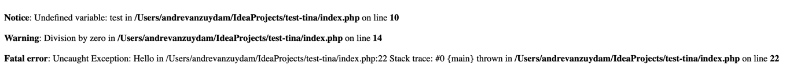
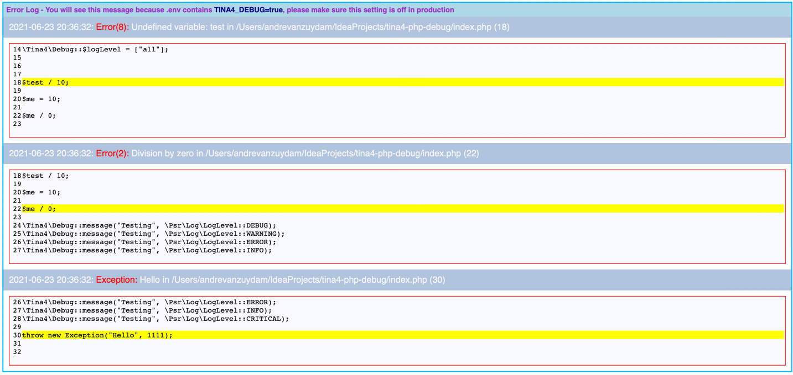
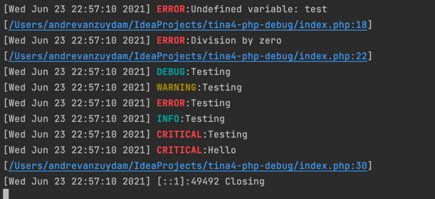

# Tina4PHP Debug
A generic debugging module which can enhance your normal PHP project

### Install the module using composer

```
composer require tina4stack/tina4php-debug
```

### Some examples of what to expect

Normal error handling looks like this



Exception handling and errors will be published to the screen automatically for you.



You also get some nice console output



### Setting this up in your project

In your code you need to set some constants to get this working.
```php index.php
<?php
const TINA4_DOCUMENT_ROOT = __DIR__;
const TINA4_DEBUG = true;
require_once "vendor/autoload.php";

//Set the level of errors

//You can code here as per normal

```
